# 人工智能课程核心

## 产业链

### 上游/基础层

- 传感器：红外、温湿度、指纹、图像（韦尔股份、奥比中光..）
- 数据采集的知识产权问题：数据确权
- 大脑
  - 云计算平台（云存储、云计算、综合云）
  - 算力：基础算力（cpu）、智能算力（gpu）、超算算力
- 硬件：EDA、存储芯片.. 立芯科技

### 中游/技术层

- 大模型 LLM：华为盘古、阿里通义、腾讯混元、百度文心...（通用大模型） 夸克浏览器（医疗大模型）
- 知识图谱/思维导图
- 操作系统、深度学习框架（pytorch、tensorflow）（国产：华为 mindspore、百度 paddle..）
- 应用技术
  - 计算机视觉 cv
  - 语音识别 科大讯飞
  - 自然语言处理 chatgpt、gpt4.0
  - 机器视觉：模拟人的眼睛的作用

### 下游/应用层

- 应用场景
  - 游戏：王者觉悟
  - 无人物流、无人零售、医疗、智慧城市（杭州）

## 学习路径

- 学 python（基本语法、面向对象）
- 数据处理分析（numpy、pandas、matplotlib）
- 机器学习概念（线性回归、逻辑回归、决策树、随机森林、SVM...）
- 深度学习
  - pytorch、anaconda
  - 零基础项目：手写数字识别、波士顿房价预测
  - 实际项目

## 课程安排

- 参考书：清华大学出版 《人工智能》 马少平
- 18 小时 12 次课
- 第 0 章绪论+第 1 章搜索第 1 节
- 第 1 章搜索 2-5 节
- 第 2 章与或图
- 第 3 章谓词逻辑
- 第 4 章知识表示
- 第 5 章不确定性推理方法 1-4 节
- 第 5 章不确定性推理方法 5-6 节+第 6 章机器学习基本概念
- 第 6 章机器学习
- 第 6 章机器学习
- 第 7 章高级搜索

## 重要章节

- 0 章
- 1.1，1.4
- 2.1，2.3
- 3.3
- 4.2，4.3，4.4
- 5.4，5.6
- 6.1，6.5，6.6
- 7.3，7.4

## 考试形式预测

- 大题（计算）

  - A\*算法
  - 极大极小搜索+α-β 剪枝
  - 谓词逻辑推理（离散数学）
  - 语义网络
  - D 分离的判断+CF 的传播、更新
  - ID3 算法计算
  - 最后补充：主观贝叶斯

- 小题（常识+概念）

  - 简答
  - 选择题
  - 判断题
  - 填空题

## 人工智能基本概念

图灵测试

中文屋子

近年来的重要时间结点

- 2016 年 deepmind 击败李世石
- 2017 年 《attention is all your need》
- 2018 年 google 提出的 bert 模型
- 2022 年 openai 提出的 chatgpt
- 2024 年 openai 提出的 sora（文本生成视频的大模型）

三大学派

- **符号主义**：立足于逻辑运算和符号操作,适合于模拟人的逻辑思维过程,解决需要逻辑推理的复杂问题。符号主义认为人类思维的基本单元是符号，而基于符号的一系列运算就构成了认知的过程，所以人和计算机都可以被看成具备逻辑推理能力的符号系统，换句话说，计算机可以通过各种符号运算来模拟人的“智能”。应用：**专家系统**
- **连接主义**：通过过**_神经元_**之间的并行协作实现信息处理,处理过程具有并行性,动态性,全局性。也被业界称为**仿生学派**，其主要原理为**神经网络**及神经网络间的连接机制与学习算法。认为人工智能源于仿生学,特别是对人脑模型的研究。它的代表性成果是 1943 年由生理学家麦卡洛克(McCulloch)和数理逻辑学家皮茨(Pitts)创立的脑模型,即 MP 模型,开创了用电子装置模仿人脑结构和功能的新途径。它从神经元开始进而研究神经网络模型和脑模型,开辟了人工智能的又一发展道路。20 世纪 60~70 年代,连接主义,尤其是对以感知机(perceptron)为代表的脑模型的研究出现过热潮,由于受到当时的理论模型、生物原型和技术条件的限制,脑模型研究在 20 世纪 70 年代后期至 80 年代初期落入低潮。直到 Hopfield 教授在 1982 年和 1984 年发表两篇重要论文,提出用硬件模拟神经网络以后,连接主义才又重新抬头。1986 年,鲁梅尔哈特(Rumelhart)等人提出多层网络中的反向传播(BP)算法。
- **行为主义**：采用行为**模拟方法**，也认为功能、结构和智能行为是不可分的。不同行为表现出不同功能和不同控制结构。行为主义学派认为人工智能源于**控制\*\***论\*\*。早期的研究工作重点是模拟人在控制过程中的智能行为和作用，并进行“控制论动物”的研制。到 20 世纪 60~70 年代，播下智能控制和智能机器人的种子，并在 20 世纪 80 年代诞生了智能控制和智能机器人系统。行为主义是 20 世纪末才以人工智能新学派的面孔出现的，引起了许多人的兴趣。这一学派的代表作首推布鲁克斯的六足行走机器人，它被看作是新一代的“控制论动物”，是一个基于感知-动作模式模拟昆虫行为的控制系统。

发展历史

**神经网络**

在机器学习中，神经网络一般指的是“神经网络学习”，是机器学习与神经网络两个学科的交叉部分。所谓神经网络，目前用得最广泛的一个定义是“神经网络是由具有适应性的简单单元组成的广泛并行互连的网络，它的组织能够模拟生物神经系统对真实世界物体所做出的交互反应”。

**神经元模型**

神经网络中最基本的单元是神经元模型（neuron）。在生物神经网络的原始机制中，每个神经元通常都有多个树突（dendrite），一个轴突（axon）和一个细胞体（cell body），树突短而多分支，轴突长而只有一个；在功能上，树突用于传入其它神经元传递的神经冲动，而轴突用于将神经冲动传出到其它神经元，当树突或细胞体传入的神经冲动使得神经元兴奋时，该神经元就会通过轴突向其它神经元传递兴奋。神经元的生物学结构如下图所示。


一直沿用至今的“M-P 神经元模型”正是对这一结构进行了抽象，也称“**阈值逻辑单元**“，其中树突对应于输入部分，每个神经元收到 n 个其他神经元传递过来的输入信号，这些信号通过带权重的连接传递给细胞体，这些权重又称为连接权（connection weight）。细胞体分为两部分，前一部分计算总输入值（即输入信号的加权和 Σxi\*wi，或者说累积电平），后一部分先计算总输入值与该神经元阈值的差值，然后通过激活函数（activation function）的处理，产生输出从轴突传送给其它神经元。**激活函数负责将神经元的输入映射到输出端，给神经元引入了非线性因素**，使得神经网络可以任意逼近任何非线性函数，这样神经网络就可以应用到众多的非线性模型中。M-P 神经元模型如下图所示：


与线性分类十分相似，神经元模型最理想的激活函数也是阶跃函数，即将神经元输入值与阈值的差值映射为输出值 1 或 0，若差值大于零输出 1，对应兴奋；若差值小于零则输出 0，对应抑制。但阶跃函数不连续，不光滑，故在 M-P 神经元模型中，也采用 Sigmoid 函数来近似， Sigmoid 函数将较大范围内变化的输入值挤压到 (0,1) 输出值范围内，所以也称为挤压函数（squashing function）。

**常用的激活函数及其导数：白皮书 p305 6.**


将多个神经元按一定的层次结构连接起来，就得到了神经网络。它是一种包含多个参数的模型，比方说 10 个神经元两两连接，则有 100 个参数需要学习（每个神经元有 9 个连接权以及 1 个阈值），若将每个神经元都看作一个函数，则整个神经网络就是由这些函数相互嵌套而成。

**感知机与多层网络**

感知机（Perceptron）是由两层神经元组成的一个简单模型，但只有输出层是 M-P 神经元，即只有输出层神经元进行激活函数处理，也称为功能神经元（functional neuron）；输入层只是接受外界信号（样本属性）并传递给输出层（输入层的神经元个数等于样本的属性数目），而没有激活函数。这样一来，感知机与之前线性模型（最小二乘法）中的对数几率回归的思想基本是一样的，都是通过对属性加权与另一个常数求和，再使用 sigmoid 函数将这个输出值压缩到 0-1 之间，从而解决分类问题。不同的是感知机的输出层应该可以有多个神经元，从而可以实现多分类问题，同时两个模型所用的参数估计方法十分不同。

给定训练集，则感知机的 n+1 个参数（n 个权重+1 个阈值）都可以通过学习得到。阈值 Θ 可以看作一个输入值固定为-1 的哑结点的权重 ωn+1，即假设有一个固定输入 xn+1=-1 的输入层神经元，其对应的权重为 ωn+1，这样就把权重和阈值统一为权重的学习了。简单感知机的结构如下图所示：


感知机权重的学习规则如下：对于训练样本（x，y），当该样本进入感知机学习后，会产生一个输出值，若该输出值与样本的真实标记不一致，则感知机会对权重进行调整，若激活函数为阶跃函数，则调整的方法为（基于梯度下降法）：


其中 **η∈（0，1）称为学习率**，可以看出感知机是通过逐个样本输入来更新权重，首先设定好初始权重（一般为随机），逐个地输入样本数据，若输出值与真实标记相同则继续输入下一个样本，若不一致则更新权重，然后再重新逐个检验，直到每个样本数据的输出值都与真实标记相同。容易看出：感知机模型总是能将训练数据的每一个样本都预测正确，和决策树模型总是能将所有训练数据都分开一样，感知机模型很容易产生过拟合问题。

由于感知机模型只有一层功能神经元，因此其功能十分有限，只能处理线性可分的问题，对于这类问题，感知机的学习过程一定会收敛（converge），因此总是可以求出适当的权值。但是对于像书上提到的**异或问题**，只通过一层功能神经元往往不能解决，因此要解决**非线性可分问题**，需要考虑使用多层功能神经元，即神经网络。多层神经网络的拓扑结构如下图所示：


在神经网络中，输入层与输出层之间的层称为隐含层或隐层（hidden layer），隐层和输出层的神经元都是具有激活函数的功能神经元。只需包含一个隐层便可以称为多层神经网络，常用的神经网络称为“**多层前馈神经网络**”（multi-layer feedforward neural network），该结构满足以下几个特点：

- 每层神经元与下一层神经元之间完全互连
- 神经元之间不存在同层连接
- 神经元之间不存在跨层连接


根据上面的特点可以得知：这里的“前馈”指的是网络拓扑结构中**不存在环或回路**，而不是指该网络只能向前传播而不能向后传播（下节中的 BP 神经网络正是基于前馈神经网络而增加了反馈调节机制）。神经网络的学习过程就是根据训练数据来调整神经元之间的“连接权”以及每个神经元的阈值，换句话说：神经网络所学习到的东西都蕴含在网络的连接权与阈值中。

**BP 神经网络算法**

由上面可以得知：神经网络的学习主要蕴含在权重和阈值中，多层网络使用上面简单感知机的权重调整规则显然不够用了，BP 神经网络算法即**误差逆传播算法**（error BackPropagation）正是为学习多层前馈神经网络而设计，BP 神经网络算法是迄今为止最成功的的神经网络学习算法。

一般而言，只需包含一个足够多神经元的隐层，就能以任意精度逼近任意复杂度的连续函数。


上图为一个单隐层前馈神经网络的拓扑结构，BP 神经网络算法也使用**梯度下降法**（gradient descent）。BP 算法首先将误差反向传播给隐层神经元，调节隐层到输出层的连接权重与输出层神经元的阈值；接着根据隐含层神经元的**均方误差 MSE**，来调节输入层到隐含层的连接权值与隐含层神经元的阈值。


学习率 η∈（0，1）控制着沿反梯度方向下降的步长，若**步长太大则下降太快容易产生震荡**，若步长太小则收敛速度太慢，一般地常把 η 设置为 0.1（基于经验设置），有时更新权重时会将输出层与隐含层设置为不同的学习率。BP 算法的基本流程如下所示：


BP 算法的更新规则是基于每个样本的预测值与真实类标的均方误差来进行权值调节，即 BP 算法每次更新只针对于单个样例。需要注意的是：BP 算法的最终目标是要最小化整个训练集 D 上的累积误差，即：


如果基于累积误差最小化的更新规则，则得到了累积误差逆传播算法（accumulated error backpropagation），即每次读取全部的数据集一遍，进行一轮学习，从而基于当前的累积误差进行权值调整，因此参数更新的频率相比标准 BP 算法低了很多，但在很多任务中，尤其是在数据量很大的时候，往往标准 BP 算法会获得较好的结果。另外对于如何设置隐层神经元个数的问题，至今仍然没有好的解决方案，常使用“试错法”进行调整。

**大模型幻觉（hallucination）：一本正经的胡说八道 / 可能是大模型重要的创造力来源**

过拟合（overfitting）

- 表现：训练集表现好、测试集表现差
- 原因：模型过于复杂、学习到了数据中不是通用性的特征、记住了数据中的噪声和细节

BP 神经网络强大的学习能力常常容易造成**过拟合**问题，有以下两种策略来**缓解** BP 网络的**过拟合问题**：

- 早停：将数据分为训练集与测试集，训练集用于学习，测试集用于评估性能，若在训练过程中，训练集的累积误差降低，而测试集的累积误差升高，则停止训练。
- 引入正则化（regularization）：基本思想是在**累积误差函数**中增加一个用于描述网络复杂度的部分，例如所有权值与阈值的平方和，其中 λ∈（0,1）用于对累积经验误差与网络复杂度这两项进行折中，常通过交叉验证法来估计，即降低模型复杂度
- 数据预处理，对数据进行标准化、归一化
- 增加数据集
- **集成学习：将多个不一样模型通过投票（离散值）/平均（连续值）的方式得到最终预测结果，降低模型的方差，提高泛化性能**
  

## 搜索

- 回溯（2 道经典问题 : n 皇后 和 求子集）

  - n 皇后：将 n 个皇后放在 n×n 的棋盘中，使得皇后之间不能互相攻击（不能同行、不能同列、不能同对角线），求 n 皇后的解决方案数量有几种？
  - https://leetcode.cn/problems/n-queens/
  - 会画搜索树
  - 会写回溯的代码（预防上机考试 保证有 c 和 c++，可能有 java 和 python）
    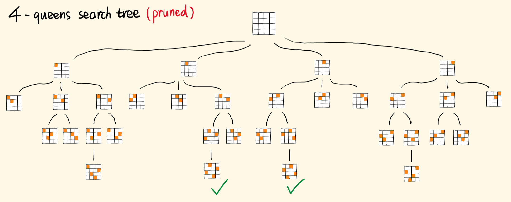
  - eg1.给你一个整数数组 nums ，数组中的元素 互不相同 。返回该数组所有可能的子集（手写代码？）
  - https://leetcode.cn/problems/subsets/
  - github (学会使用梯子、git 命令基本操作)

  ```JavaScript
  输入：nums = [1,2,3]
  //注意空子集
  输出：[[],[1],[2],[1,2],[3],[1,3],[2,3],[1,2,3]]
  ```

  ```JavaScript
  // 回溯模板
  // void backtracking(参数)
  // {
  //     if (终止条件)
  //     {
  //         存放结果;
  //         return;
  //     }
  //     for(选择本层的所有元素/树中节点的子节点的数量){
  //         处理节点;
  //         backtacking();
  //         撤销处理;
  //     }
  // }

  var subsets = function (nums) {
      const result = []

      function backTrack(start, curr) {
          // 把curr加入result数组
          result.push([...curr])
          for (let i = start; i < nums.length; i++) {
              curr.push(nums[i])
              backTrack(i + 1, curr)
              // 把curr最后一个元素移除
              curr.pop()
          }
      }

      backTrack(0, [])
      return result
  }
  ```

- 图搜索

  - 深度优先
  - 广度优先
  - 启发式搜索 A\* （A star）**只考填表，不会考代码**

    - 1968 年提出的基于采样搜索的路径规划算法
    - 处理例子：

      - 网格化：连续问题转化为离散
      - 每次都取局部最优，未必能有全局最优
      - 处理策略 1：每次都取离终点最近的那个，但是贪心策略本身有问题
      - 处理策略 2：选取离起点（历史数据）和终点的距离之和最小
      - 为什么考虑历史数据就能避免贪心带来的问题？
      - 把距离称为代价 f，和起点的距离称为历史代价 g 和终点的距离称为未来预期代价 h

    - **f=g+h**
    - g 表示从起点到当前位置的距离
    - h 表示从当前位置到终点的估算距离

      - 曼哈顿距离 用于只能朝上下左右 4 个方向移动 d=|x1-x2|+|y1-y2|，基本只在二维平面使用
      - 欧几里得距离 任意方向移动 多维可用

    - 应用举例 迷宫路径搜索 地图最佳路径规划

  - 动态规划法（上机必考、面试问答）

    - 基本概念
      - 动态规划算法通常用于求解具有某种最优性质的问题。在这类问题中，可能会有许多可行解。每一个解都对应于一个值，我们希望找到具有最优值的解
      - 动态规划算法与分治法类似，其基本思想是将待求解问题分解成若干个子问题，先求解子问题，然后从这些子问题的解得到原问题的解。与分治法不同的是，适合于用动态规划求解的问题，经分解得到子问题往往不是互相独立的。若用分治法来解这类问题，则分解得到的子问题数目太多，有些子问题被重复计算了很多次
      - 如果我们能够保存已解决的子问题的答案，而在需要时再找出已求得的答案，这样就可以避免大量的重复计算，节省时间。我们可以用一个表来记录所有已解的子问题的答案。不管该子问题以后是否被用到，只要它被计算过，就将其结果填入表中
    - eg1.假设你正在爬楼梯。需要 n 阶你才能到达楼顶。**每次你可以爬 1 或 2 个台阶**。你有多少种不同的方法可以爬到楼顶呢？
    - 用 f（x）表示爬到第 x 级台阶的方案数量 ==》**f（x）=f（x-1）+f（x-2）**
    - 从第 0 级爬到第 0 级：f（0）=1
    - 从第 0 级爬到第 1 级：f（1）=1
    - 爬到第 2 级：f（2）=f（0）+f（1）=2，以此类推...

    ```JavaScript
    var climbStairs = function (n) {
        const memo = []
        // 到第1个台阶有1种方法
        memo[1] = 1
        // 到第2个台阶有2种方法
        memo[2] = 2
        for (let i = 3; i <= n; i++) {
            memo[i] = memo[i - 1] + memo[i - 2]
        }
        return memo[n]
    }
    ```

    - eg2.你是一个专业的小偷，计划偷窃沿街的房屋。每间房内都藏有一定的现金，影响你偷窃的唯一制约因素就是相邻的房屋装有相互连通的防盗系统，**如果两间相邻的房屋在同一晚上被小偷闯入，系统会自动报警**。给定一个代表每个房屋存放金额的非负整数数组，计算你 不触动警报装置的情况下 ，一夜之内能够偷窃到的最高金额。
    - 确定数组含义：dp【i】表示在第 i 号房子**之前**能偷到的最大金额
    - 状态转移：
      - 第 i-2 号房子前可偷窃的金额+当前 i 号房子可偷窃金额
      - 第 i-1 号房子前可偷窃的金额
      - 二者取最大值作为当前的 dp【i】
      - 方程：dp【i】=max（dp【i-2】+nums【i】，dp【i-1】）
    - dp 数组初始化
      - dp【0】= nums【0】
      - dp【1】= max（nums【0】，nums【1】）

    ```JavaScript
    输入：[2,7,9,3,1]
    输出：12
    解释：偷窃 1 号房屋 (金额 = 2), 偷窃 3 号房屋 (金额 = 9)，接着偷窃 5 号房屋 (金额 = 1)。偷窃到的最高金额 = 2 + 9 + 1 = 12
    ```

    ```JavaScript
    var rob = function (nums) {
        if (nums.length === 0) {
            return 0
        }
        if (nums.length === 1) {
            return nums[0]
        }

        // 记录每个点能偷到的最大金额
        const memo = []
        memo[0] = nums[0]
        memo[1] = Math.max(nums[0], nums[1])
        for (let i = 2; i < nums.length; i++) {
            // 比较 偷当前+前2个能偷的最大值 和 前1个能偷的最大值
            memo[i] = Math.max(nums[i] + memo[i - 2], memo[i - 1])
        }

        return memo[nums.length - 1]
    }
    ```

- 习题推荐：课本 p55 1.1 1.3
- 与或图

  - 概念定义

    - 与或图是一个超图，节点间通过连接符连接图中存在括弧，括弧标识图中的父子节点间存在**与**关系
    - **k-均匀超图**指超图的每个边连接的顶点个数都是相同的，即为个数 k。**2-均匀超图就是传统意义上的图**
    - 能解节点
      - 终节点是能解节点（题目说谁是终点）
      - 若非终节点有“或”子节点时，当且仅当其子节点至少有一能解时，该非终节点才能解
      - 若非终节点有“与”子节点时，当且仅当其子节点均能解时，该非终节点才能解
    - 不能解结点
      - 没有后裔的非终节点是不能解节点。
      - 若非终节点有“或”子节点，当且仅当所有子节点均不能解时，该非终节点才不能解。
      - 若非终节点有“与”子节点时，当至少有一个子节点不能解时，该非终节点才不能解。

  - AO\\*与 A\\*的比较

    1. AO\*算法不能像 A 算法那样,单纯靠评价某一个结点来评价局部图
    2. 由于**k-连接符**连接的有关子结点,对父结点能解与否以及耗散值都有影响,因而不能像 A 算法那样优先拓展其中具有最小耗散值的结点
    3. AO\*算法仅适用于**无环图**的假设,否则耗散值递归计算不能收敛,因而在算法中还必须检查新生成的结点已在图中时,是否是正在被拓展结点的先辈结点
    4. A 算法设有 OPEN 表和 CLOSE 表,而 AO\*算法只用一个图结构 G,它代表到目前为止已显式生成的部分搜索图,图中每个结点的 h(n)值是估计最佳解图,而不是估计解路径

  - 构建 AO\*算法步骤

    - 建立搜索图，计算启发式代价
    - 选择节点：选择最小代价的结点
    - 扩展结点：生成所有可能的后继，对于每个后继计算代价
    - 更新路径：后继节点的启发式代价小于当前，更新
    - 终止条件：找到目标节点/代价小于题目要求

- 博弈问题

  - 特点/定义
    - 零和 两人都使用最优策略来获取胜利
    - 有限 无论两人怎样决策，都会在有限步后决出胜负
    - 公平 两人进行决策所遵循的规则相同
  - 只出现一次的数字
    - 给你一个非空整数数组 nums ，除了某个元素只出现一次以外，其余每个元素均出现两次。找出那个只出现了一次的元素。你必须设计并实现线性时间复杂度的算法来解决此问题，且该算法只使用常量额外空间（时间复杂度 on，空间复杂度 o1）
    - 异或/不进位加法：同 0 异 1
    - 把所有数组元素进行异或操作，最终的计算结果就是只出现一次的元素
  - Nim 游戏
    - 给定 n 堆石子，两位玩家轮流操作，每次操作可以从任意一堆石子中拿走任意数量的石子（可以拿完，但不能不拿），最后无法进行操作的人视为失败。问如果两人都采用最优策略，先手是否必胜。
    - 最简单情况
      - 如果轮到你的时候，只剩下一堆石子，那么此时的必胜策略肯定是把这堆石子全部拿完一颗也不给对手剩，然后对手就输了.
      - 如果剩下两堆不相等的石子，必胜策略是通过取多的一堆的石子将两堆石子变得相等，以后如果对手在某一堆里拿若干颗，你就可以在另一堆中拿同样多的颗数，直至胜利。
      - 如果你面对的是两堆相等的石子，那么此时你是没有任何必胜策略的，反而对手可以遵循上面的策略保证必胜。
    - 情况拓展
      - 如果先手玩家能够时刻保持每堆石头的数量相同，那么无论后手玩家如何操作，先手玩家都可以通过相应的操作使得每堆石头的数量再次相同
    - 结论：如果有 n 堆石子，每堆石子的个数分别为：a1, a2, a3, a4......an，若：$a_1\oplus a_2\oplus a_3\oplus a_4.\ldots\ldots\oplus a_n\neq0$，则先手必胜，否则先手必输
    - 证明
      - 若当前**a1 到 an 的异或和=x**，不为 0，我们一定有办法让异或和为 0：从某一堆石头里拿走若干个，就可以让剩下的数字异或和为 0
        - x 的二进制表示中，一定存在一个为 1 最高位，设为第 k 位
        - 意味着 a1 到 an 中至少存在某个数 ai 它的二进制表示的第 k 位为 1
        - ai 和 x 进行异或的结果＜ ai
        - 从 ai 这堆石头里拿走“ai-（ai 异或 x）”个石头，剩下石头的数量就是 ai - “ai-（ai 异或 x）” = “ai 异或 x”个
        - 剩下的所有石头的异或和 = a1 异或 a2... 异或 ai-1 异或 "ai 异或 x" 异或 ai+1 ... an = a1 到 an 的异或和 异或 x = x 异或 x = 0
  - 石子游戏（尝试用动态规划的方法解）
    - https://leetcode.cn/problems/stone-game/description/
    - 对石头进行编号：0，1，2，...，2n+1
    - 分组
      - 第一组：0，2，4，6...2n
      - 第二组：1，3，5，7...2n+1
    - 对第一组和第二组分别求和
    - 若第一组的总和大，先手的人从最左边开始选，保证后手只能从奇数编号的石堆里选
    - 若第二组总和大，从最右边开始选
    - 先手必胜
  - Grundy 博弈问题
    - 有一堆数目为 N 的钱币，由两位选手轮流进行分堆，要求每个选手每次只把其中某一堆分成**数目不等的两小堆**，直到有一位选手无法把钱币再分成不相等的两堆时就得认输。
    - 以 N=7 为例，游戏中分为 MIN 方和 MAX 方(需要会画博弈树的图)
      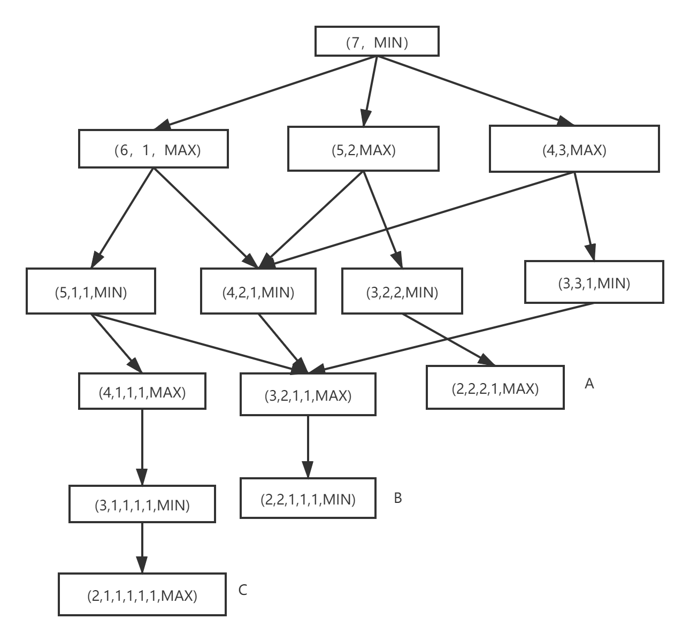
  - 极小极大搜索
    - 试图利用完整的博弈树来进行极小极大分析是困难的。可行的办法是**只生成一定深度的博弈树**, 然后进行极小极大分析,找出当前最好的行动方案
    - 对“或”节点, 选其子节点中一个最大的得分作为父节点的得分,这是为了使自己在可供选择的方案中选一个对自己最有利的方案；对“与”节点, 选其子节点中一个最小的得分作为父节点的得分,这是为了立足于最坏的情况
  - α-β 剪枝
    - 是对极大极小法的优化，通过剪枝减少某些结点的访问，它的搜索结果与极小极大法一致
    - α 剪枝：若任一极小值层结点的 β 值小于等于它任一先辈的极大值层的 α 值，即 α（先辈）>=β（后继）
    - 例 1
      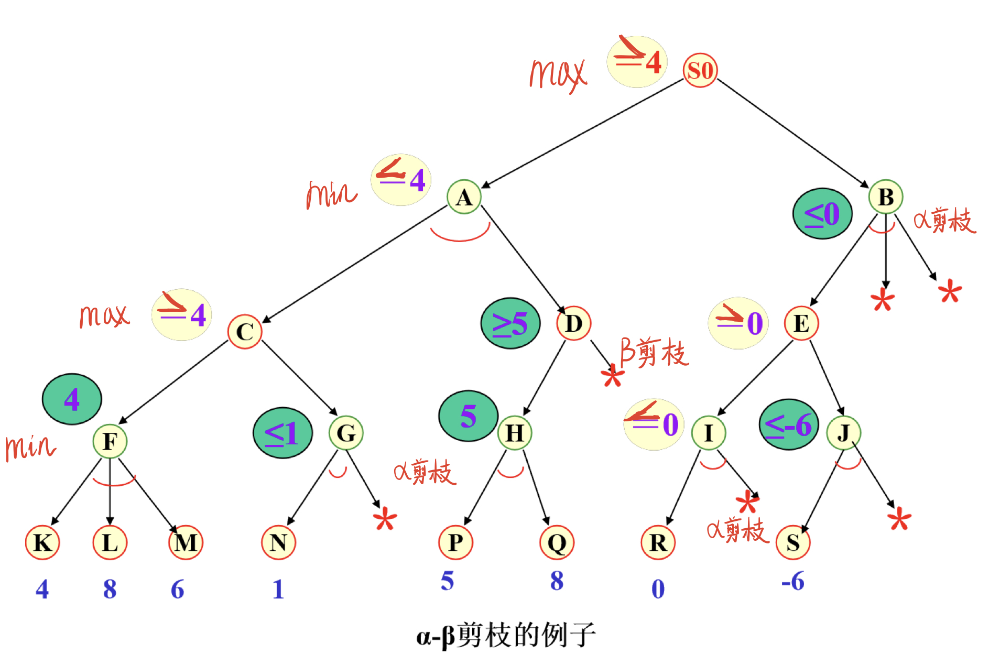
    - 例 2
      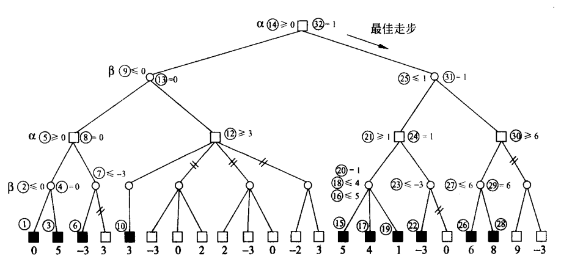
  - 习题推荐：课本 p75 2.1 2.6

## 谓词逻辑

- 重要概念（面试、笔试）

  - p78 命题的定义
  - p81 范式（合取范式、析取范式）、范式的性质
  - p83 常用推理定律（后面 5 条）
  - p85 归结原理
  - p86 子句、子句集
  - 白皮书 p411 命题逻辑和谓词逻辑的关系和区别？
  - p95 例题 3.10，给定前提和结论，写出证明过程（用的是什么推理定律）
  - p99 前束范式、skolem 标准型；例 3.12 求 skolem 标准型
  - p101 子句集的求取
  - p114 Herbrand 定理思想
  - p119 语义树的意义

- 习题推荐：课本 p122

  - 定义类 3.1 3.2 3.6 3.9 3.11
  - 计算类 3.23 3.24
  - 选做 3.16 3.21

- 基本定义

  - 谓词公式的永真性：如果**谓词公式 P**对**非空个体域 D**上的任一解释都取得真值 T，则称 P 在 D 上是永真的；如果 P 在任何非空个体域上均是永真的，则称 P 永真。
  - 谓词公式的**可满足性**：对于谓词公式 P，如果至少存在非空个体域 D 上的一个解释，使公式 P 在此解释下的真值为 T，则称公式 P 在 D 上是可满足的。谓词公式的可满足性也称为相容性。
  - 谓词公式的永假性：如果谓词公式 P 对非空个体域 D 上的任一解释都取真值 F，则称 P 在 D 上是永假的；如果 P 在任何非空个体域上均是永假的，则称 P 永假。谓词公式的永假性又称不可满足性或不相容。
  - 谓词公式的**等价性**：设 P 与 Q 是 D 上的两个谓词公式，若对 D 上的任意解释，P 与 Q 都有相同的真值，则称 P 与 Q 在 D 上是等价的。如果 D 是任意非空个体域，则称 P 与 Q 是等价的。

  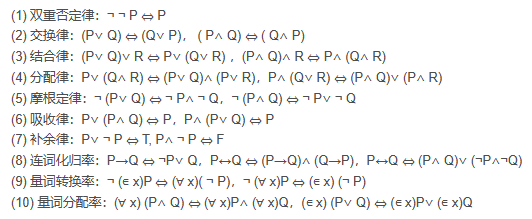
  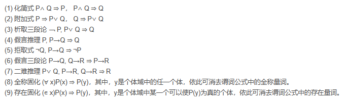

- 谓词逻辑表示的步骤

```javascript
// 武汉是个美丽的城市，但不是沿海城市。谓词逻辑表示为：
是个美丽的城市(武汉) ∧ ¬是个沿海城市(武汉)

// 机器人站在墙边，手里没有拿东西，桌子上放着积木。谓词逻辑表示为：
在旁边站着(机器人,墙) ∧ 手空着(机器人) ∧ 在上面(积木,桌子)

//机器人拿起积木，谓词表示方法为：
//删除"手空着(机器人)∧在上面(积木,桌子)"，增加"拿着(机器人,积木)"，如下：
在旁边站着(机器人,墙) ∧ 拿着(机器人,积木)
```

- 范式是谓词公式的标准形式，范式包括前束范式和 Skolem 范式两种

  - 前束范式

  1. 所有量词均非否定地出现在公式的最前面
  2. 所有**量词**的辖域为整个公式。如：(∀ x) (∀ y) (∊ z)(P(x)∧ Q(y,z)∨ R(x,z))

  - Skolem 范式(Skolem 标准型)

  1. 前束范式
  2. 所有的**存在量词都在全称量词之前**。如：**(∊ x) (∊ z)** _(∀ y)_(P(x)∨ Q(y,z)∧ R(x,z))

- 置换与合一

  - 在基于谓词的推理过程中，会出现谓词名相同但其个体不同的情况，此时不能直接进行匹配的，需要先进行置换。在推理过程中，寻找项与项之间的置换，使不同谓词表达式一致的过程叫做合一的过程。

- 子句集的化简

  1. 消条件 消去条件连接词“→”和“↔”。
     反复使用等价公式：P→Q ⇔ ﹁ P∨ Q，P↔Q ⇔ (P∧ Q)∨ (﹁P∧ ﹁Q)
  2. 减否定 将每个否定符号“﹁”移到紧靠谓词的位置，使得每个否定符号**最多只作用于一个谓词**上。
  3. 量词变元一致 在一个量词的辖域内，把谓词公式中受该量词约束的变元全部用另外一个没有出现过的任意变元代替。
  4. 化前束 把所有量词都移到公式的左边
     如将：(∀ x)((∊ y)﹁P(x，y)∨ (∊ z)( Q(x，z) ∧ ﹁R(x，z))) 化为：
  5. **_消存在_** 若存在量词不出现在全称量词的辖域内（即它的左边没有全称量词），只要用一个新的个体常量替换受该存在量词约束的变元，就可消去该存在量词。若存在量词位于一个或多个全称量词的辖域内，例如 (∀ x1)…(∀ xn) (∊ y)P(x1,x2,…,xn, y)，则需要用 Skolem 函数 f(x1,x2,…,xn)替换受该存在量词约束的变元 y，然后再消去该存在量词。 **如将：(∀ x)(∊ y) (∊ z)(﹁P(x，y)∨ ( Q(x，z) ∧ ﹁R(x，z))) 化为：(∀ x)(﹁P(x,f(x))∨ (Q(x,g(x))∧ ﹁R(x,h(x))))**
  6. 化 skolem 合取式使用等价关系：**_P∨ (Q∧ R) ⇔ (P∨ Q)∧ (P∨ R)_** 如将：(∀ x)(**﹁P**(x,f(x))**∨** (**Q**(x,g(x))**∧** **﹁R**(x,g(x)))) 化为：(∀ x)((**﹁P**(x,f(x))**∨** **Q**(x,g(x))**∧** (**﹁P**(x,f(x))∨ **﹁R**(x,g(x))))
  7. **_消全称_** 由于母式中的全部变元均受全称量词的约束，并且全称量词的次序已无关紧要，因此可以省掉全称量词
  8. 化子句如将：(﹁P(x,f(x))∨ Q(x,g(x)) ∧ (﹁P(x,f(x))∨ ﹁R(x,g(x)))化为：
     子句 1）：﹁P(x,f(x))∨ ﹁R(x,g(x)) 子句 2）：﹁P(x,f(x))∨ Q(x,g(x))
  9. 换变元
     对子句集中的某些变量重新命名，使任意**_两个子句中不出现相同的变量名_**

- Herbrand 定理

  - 归结原理依赖于一个单一的规则，即：**p V q 和 ~q V r 都为真，则 p V r 为真**。此规则可以由**真值表**证明是正确的
  - Herbrand 定理就是把**证明永真转换为不可满足**
  - 其基本思想就是：将待证明逻辑公式的结论，通过等值公式转换成附加前提，再证明该逻辑公式是不可满足的
  - 证明过程
    1. 建立待归结命题公式。首先根据**_反证_**法将所求证的问题转换为命题公式，求证其是矛盾式（**永假**式）
    2. 求合取范式
    3. 建立子句集
    4. 归结，对子句集中的子句使用归结规则:归结式作为新子句加入子句集参加归结。归结式为空子句 Nil，停止。得到空子句 Nil，表示 S 是不可满足的（矛盾），故原命题成立

## 知识表示 / 知识图谱

- 考察要点
- ```
  1. 产生式系统的推理
  2. 把一句话用语义网络表示出来 p143图4.17
  ```
- 知识的定义

```text
知识是人类对客观世界的认识和经验。

知识是经过加工的信息。是把有关信息关联在一起所形成的信息结构。
```

- 知识的分类

```text
1. 事实性的知识
2. 过程性的知识
3. 元知识：有关知识的知识 / 控制已有的知识
```

- 知识的特点

```text
相对正确性：任何知识都是在一定条件和环境下产生的，在特定的条件和环境下才是正确的。

不确定性：随机性引起的、模糊性引起的、经验引起的、不完全性引起的

可表示性与可利用性：知识可以用适当的形式表示出来，如语言、文字、图形、神经网络等。
```

- 知识表示的原则

```text
  正确有效地表示知识

  便于理解和实现

  便于知识组织、维护、管理

  便于利用

  便于知识获取
```

- 知识表示的分类
  - 替代表示
    - 直接表示
    - 局部表示
      - 陈述性表示
        - 逻辑表示
        - 产生式表示
        - 语义网络表示 -- 框架表示 / 脚本表示
      - 过程性表示
  - 分布表示

```text
陈述性知识表示：以数据的形式表示(将知识表示与知识运用分开处理)简洁、严谨；工作效率低

过程性知识表示：知识表示形式是一个过程(将知识表示和知识运用相结合)不够严格，不易修改；易于推理
```

- 主要知识表示方法

```text
谓词逻辑表示法

语义网络表示法

框架表示法

过程表示法

Petri网表示法

面向对象表示法

人工神经元网络(ANN)表示法
```

- 产生式表示法

  - 在研究人类的认知模型中开发了基于**规则**的产生式系统。
  - 通常用于表示事实、规则以及他们的不确定性度量。
  - 产生式通常用于表示具有因果关系的知识，其基本形式为 IF P THEN Q

- **确定性**规则知识的产生式表示 P→Q：IF P THEN Q

  - P 是产生式的前提，Q 是一组**结论或操作**
  - 比如：IF 动物会飞 AND 会下蛋 THEN 该动物是鸟; IF 温度高于 30 度 THEN 关门
  - 产生式可以提供操作，谓词公式不能提供操作

- **不确定性**规则知识的产生式表示 P→Q(可信度)：IF P THEN Q(**可信度**)

  - 比如：IF 发烧 THEN 感冒(0.6)

- 确定性事实知识的产生式表示

  - 三元组表示：(对象,属性,值) 或者：(关系,对象 1,对象 2)
  - 比如：(老李,年龄,40)
  - 比如：(朋友,老王,老李)

- 不确定性事实知识的产生式表示

  - “四元组表示：（对象,属性,值,置信度）” 或者：(关系,对象 1,对象 2,置信度)
  - 比如：(老李,年龄,40,0.8) (朋友,老王,老李,0.1)

- 产生式系统的结构（简答）
  - 问题：请你描述产生式系统的结构中各个组成部分的基本概念，并且给出生式系统的结构示意图。
  - 数据库：事实
  - 规则库：产生式集合
  - 推理机：将事实和规则进行匹配；匹配到的规则超过一条怎么处理？
  - 课本 p133 图 4.3 会画
- 实际推理
  - 课本 p134 图 4.4
  - 正向推理/自底向上
  - 反向推理/自顶向下
  - 双向推理
- 形式描述及语义

```text
<产生式>::=<前提> <结论>
        ::=表示定义为
        空格分开表示顺序执行
        |表示或者是
        []表示可选

<前提>::=<简单条件>|<复合条件>

<复合条件>::=<简单条件>AND<简单条件>[AND...]
            |<简单条件>OR<简单条件>[OR...]

<结论>::=<事实>|<操作>

<操作>:=<操作名>[(<变量>,...)]
```

- 产生式系统

  - 一组产生式可以放在一起，相互配合，**一个产生式生成的结论供另一个产生式作为已知事实，获得问题的解决，这样的系统称为产生式系统**。产生式系统由 3 部分组成

    - 规则库：用于描述某领域内的知识(规则)的产生式集合
    - 综合数据库：(事实库、**上下文 context**)一个用于存放问题求解过程中各种当前信息的数据结构
      - 计算机操作系统中：context 执行任务需要的相关信息，如一段代码、一个线程、一个进程、一个函数...... 当前任务需要保存的信息，都可以用 context 存储。保存 PC、寄存器的值、主存的内容。
    - 控制系统(推理机)：由一组程序组成， 负责系统的运行， 实现对问题的求解控制系统从综合数据库中提取事实前提，应用规则库的规则进行推理，解决问题。

- 语义网络

  - 语义网络表示法是研究人类联想记忆时提出的一种心理学模型。语义网络是一种通过概念及其语义联系(关系)来表示知识的有向图。
  - 表示方法
    - 用框图表示，**框图**包括节点和有向弧组成
    - 节点用来表示事物的名称、概念、属性、状态、事件及动作等
    - 弧有方向、有标注。表示事物之间的关系，即语义关系
      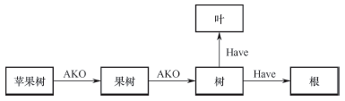
      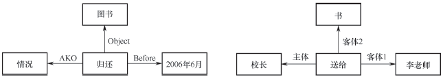
  - 语义关系（多种答案）
    - 从属关系 AKO(A-Kind-Of)：属于…类型。例如： 苹果树 AKO 树 AKO 植物  
      AMO(A-Member-Of)：是…的成员。例如：小明 AMO x 班学生  
      ISA(Is-A)：是一个…。例如：参观者 ISA 人
    - 包含关系 APO(A-Part-Of)：是…的一部分。例如： 轮胎 APO 汽车  
      CO(Composed-Of)：由…构成。例如：整数 CO 正整数 零 负整数
    - 属性关系 Have：有…属性。例如：树 Have 叶  
      Can：能够做…事情。例如：鸟 Can 飞
    - 时间关系 Before：在…时间之前。例如：小明毕业 Before 小王毕业  
      After：在…时间之后
    - 位置关系 On：在…上
      At：在…位置。例如：积木 At 桌面
      Under：在…之下
      Inside：在…之内
      Outside：在…之外
    - 相近关系 Similar-to
      Near-to
    - 推论关系 BO(because-Of)：由于…  
      FOR：为了…  
      THEN：则…  
      GET：得到…
    - 复合逻辑
      NOR(非)
      AND(与)。例如： 时间 → 与 ← 地点
      OR(或)
  - Event 型语义网络
    - agent（主语）
    - object（宾语）
    - 事件
    - 课本 p142 图 4.15
  - 语义网络表示知识的步骤
    1. 确定对象和对象的属性
    2. 确定对象间的关系
    3. 根据语义网络涉及的关系，整理结点（对象结点、动作结点、情况结点）和弧
  - 语义网络的推理过程
    - 用语义网络表示知识的问题求解系统主要由两部分组成，一部分是由语义网络构成的知识库，另一部分是用于问题求解的推理机。语义网络的推理过程主要有两种：继承和匹配。
    - 继承推理：上层结点的属性传递到下层结点。比如动物的特征会传递到鸟、鱼等
    - 匹配推理：从知识库的语义网络中寻找与目标问题相符的语义网络模式

- 框架表示法

  - 框架的组成
    - 问题：描述一下框架的组成，并自己拟定一个框架实例
    - 如课本 p150 例题 4.3
    - 框架由若干个称为“槽"slot 的结构组成
    - 槽描述对象某一方面的属性
    - 每个槽划分为若干个”侧面“
    - 侧面描述相应属性的一个方面
  - 框架一般结构

  ```text
  <框架名> 槽名1：  侧面名  侧面值,侧面值...
                 侧面名  侧面值,侧面值...
                 ...
         ....
         槽名n：  侧面名  侧面值,侧面值...
                  侧面名  侧面值,侧面值...
                  ...
         约束：约束条件
  ```

  ```text
  框架名：<教师>
                 姓名：姓、名
                 年龄：xxx岁
                 性别：范围(男、女)         缺省：男
                 住址：<住址框架>
                 ...
  ```

  - 框架的特点

    - exxtend 继承性, 比如：地震框架、洪水框架、台风框架都可以继承自**自然灾害事件框架**
    - 结构化
    - 自然性
    - 优点：适应性强，结构性好，推理方式灵活
    - 缺点：缺乏形式理论，无法保证问题的可解性

  - 框架的推理过程
    - 课本 p151 图 4.25

- 面向对象方法

  - 面向对象方法与面向对象的编程语言思想基本一致，用类抽象世界，用对象表示世界，用封装、继承、消息来表示推理规则。
  - 世界由”对象“组成，任何事物都是对象
  - 复杂的对象由简单的对象组成
  - 对象被分成各种对象类
  - 对象间出了互递消息外，不再有其他联系
  - 对象按类、子类、父类等概念形成一种层次或树形关系

- 推荐习题：课本 p158 4.11 4.13

- 知识图谱

  - 2012 年首次被 google 提出，最初为了提高搜索引擎的能力

  - 定义本质上，知识图谱主要目标是用来描述真实世界中存在的各种实体和概念，以及他们之间的关系，因此可以认为是一种**语义网络**。从发展的过程来看，知识图谱是在 NLP 的基础上发展而来的。知识图谱和自然语言处理 NLP 有着紧密的联系，都属于比较顶级的 AI 技术。知识图谱可以用来更高的查询复杂的关联信息，从语义层面理解用户意图，改进**搜索**质量。
  - 通用表示方式其基本组成单位是“实体—关系—实体”三元组，以及实体及其相关属性—值对，实体间通过关系相互联结，构成网状的知识结构。同时每个节点代表的实体还存在着一些属性，比如“《觉醒年代》”这个节点，我们可以把一些基本信息作为属性，比如影片名称、发行时间、影片类型、集数等。
    
    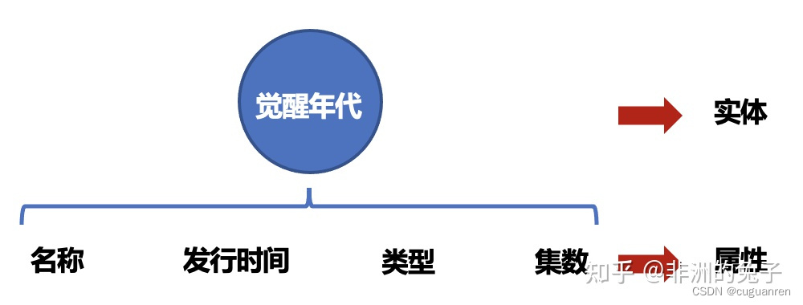

  - 图
    - 由顶点和边构成的特定对象
  - 属于符号主义（symbolism）
  - 构建过程

    - 知识抽取：将结构化、非结构化的知识抽取成“实体-关系-实体”的三元组形式，对于非结构化的内容（如一篇推文）需要用到自然语言处理的其他技术
    - 知识融合：将不同数据源的数据进行整合
    - 知识存储：用图数据库存储，建立动态更新和动态扫描机制
    - 知识展示：可视化
    - 知识分析：通过图计算，挖掘传统经验规则难以发现的知识，路径研究、点分类、边预测、图表示...

  - 技术栈：python、neo4j、pandas、graphx...

  - 技术点举例

    - 点分类（客户识别）：基于图谱分析客户信用评分、营销获客
    - 路径发现（金融领域）：资金流向分析、关联公司路径分析挖掘
    - 子图研究（社群关系）：客群研究...

  - 知识图谱的应用

  1. 搜索和问答领域

  ```text
  在NLP领域，知识图谱的应用主要集中在搜索和推荐领域，问答系统（其本质也是搜索和推荐的延伸）。

  在语义搜索这一块，知识图谱的搜索不同于常规的搜索，常规的搜索是根据keyword找到对应的网页集合，然后通过Page Rank等算法去给网页集合内的网页进行排名，然后展示给用户；

  基于知识图谱的搜索是在已有的图谱知识库中遍历知识，然后将查询到的知识返回给用户，通常如果路径正确，查询出来的知识只有1个或几个，并且相当精准。

  在问答系统中，系统同样会首先在知识图谱的帮助下对用户使用自然语言提出的问题进行语义分析和句法分析，进而将其转化成结构化形式的查询语句，然后在知识图谱中查询答案。

  搜索的终极目标是对万物直接进行搜索。传统搜索是靠网页之间的超链接实现网页的搜索，而语义搜索是直接对事物进行搜索，比如人、物、机构、地点等，这些事物可以来自文本、图片、视频、音频、物联网设备等。

  知识图谱和语义技术提供了关于这些事物的分类、属性和关系的描述，这样搜索引擎就可以直接对事物进行搜索。

  比如我们想知道“《觉醒年代》的导演是谁？”，那么在进行搜素时，搜索引擎会把这句话进行分解，获得“《觉醒年代》”，“导演”，再与现有的知识库中的词条进行匹配，最后展现在用面前。

  传统的搜索模式下，我们进行这样的搜索后得到的通常是包含其中关键词的网页链接，我们还需要在多个网页中进行筛选。可以看出基于知识图谱的搜索更加便捷与准确。

  人与机器通过自然语言进行问答与对话也是人工智能实现的标志之一，知识图谱也广泛应用于人机问答交互中。借助自然语言处理和知识图谱技术，比如基于语义解析、基于图匹配、基于模式学习、基于表示学习和深度学习的知识图谱模型。
  ```

  2. 辅助大数据分析

  ```text
  知识图谱也可以用于辅助进行数据分析与决策。

  不同来源的知识通过知识融合进行集成，通过知识图谱和语义技术增强数据之间的关联，用户可以更直观地对数据进行分析。

  此外知识图谱也被广泛用于作为先验知识从文本中抽取实体和关系，也被用来辅助实现文本中的实体消歧，指代消解等。
  ```

  - 知识抽取的任务
    - 命名实体识别（NER）：“北京时间 3 月 6 日，骑士后来居上，以 119-112 击败公牛” ==》 地点-北京； 时间-3 月 6 日；组织/队伍-骑士；组织/队伍-公牛。抽取文本中的地名，组织机构，位置，时间，数值...
    - 关系抽取：王思聪是王健林的独子 ==》（王健林，父子关系，王思聪）
    - 事件抽取：把新闻报道中的一段话用结构化的形式描述
      - 恐怖袭击事件
        - 事件：爆炸
        - 时间：
        - 地点：
        - 攻击者：
        - 伤亡人数：
    - 共指消解：弄清楚一句话中的代词（它，他，她，it，them...）所指代的对象是谁？

  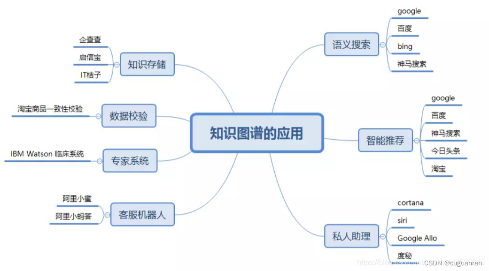

## 自然语言处理（natural language process，NLP）

### 人工智能三个层次

- 运算职能：数据存储和计算能力上超越人类
- 感知职能：视觉、听觉，即语音识别和图像识别领域，比肩人类（单体识别的准确性有浮动）
- 认知职能：自然语言处理、常识建模和推理，进步空间大
- sora（文生视频）

### 演进

#### 古代（词表示）2013 年之前

- one-hot 编码
  - 用一个词表大小的向量表示一个词，词对应的位置为 1，其余位置都是 0
  - 高维、稀疏
  - 无法表示语义之间的相似性（余弦相似度），因为计算结果都是 0
- 分布式表示
  - 上下文：取一个单词作为中心，该单词前后几个词就是它的上下文/窗口
  - 设计期望：相似的词应该具有相似的上下文，词的语义可以用上下文表示
  - 词频表示：基于语料库，统计每个词组出现的频率；没有解决稀疏性的问题；无法反映高阶的关系（A,B;B,C;C,D ==> A，D）
  - TF-IDF（早期搜索引擎利用的技术之一）：的，你...这种没什么太大意义的词，会多次出现；tfidf 选择的是当前文档中高频但是其他文档中较低或者一般的词，就可以认为这个词具有一定的代表性
  - 潜在语义分析（LSA，latent semantic analysis）：对词频矩阵进行奇异值分解 SVD，就可以得到低维、稠密的向量。词表过大时 SVD 分解速度慢；当语料库更新时，整个矩阵都需要重新计算

#### 近代（静态词向量 Word2Vec）（2013-2017）

- 设计思想：期待系统无需人工标注，自主从文档中学习知识
- CBOW（continous bag-of-words，连续词袋模型）：把上下文单词对应的词向量进行算数平均，结果作为预测词的词向量
- skip-gram：通过中心词预测上下文
- Glove（global vectors for word representation）：基于 SVD 算法和上下文窗口方法共同构建
- 缺陷：都是静态的，不具备随着上下文变化而变化的能力

#### 现代（2018+）

- 基石：Transformer（推荐阅读：《attention is all you need》https://arxiv.org/abs/1706.03762）
- 比传统的 RNN（循环神经网络）能建模更远的依赖关系，attention 机制把词与词之间的距离缩小到 1，对长序列数据建模能力更强
- 更好利用 GPU 的并行计算能力
- 参数量大，需要更多的训练数据
- 分支 1：自回归语言模型（GPT 系列），主要用于文本生成
- 分支 2：自编码语言模型（BERT 系列），对现有文本进行补齐、预测

## 不确定性推理

- 概述

  - 人工智能经典三大基本技术为：知识表示、推理、搜索策略。推理是人类求解问题的主要思维方法。无论是人类智能还是人工智能，都离不开不确定性的处理。可以说，智能主要反映在求解不确定性问题的能力上。因此，不确定性推理模型是人工智能和专家系统的一个核心研究课题。

- 简答

  - 课本 p160 证据的不确定性、规则的不确定性（图 5.1）
  - 课本 p161 表示问题、计算问题、语义问题

- 不确定性推理方法分类

  - 模型方法
    - 数值模型方法
      - 基于概率
        - 概率方法（纯概率法应用受限）
        - 贝叶斯方法
        - 可信度方法
        - 证据理论
      - 基于模糊理论
        - 模糊方法
    - 非数值模型方法
      - 发生率计算方法
  - 控制方法
    - 尚没有统一模型。控制方法没有处理不确定性的统一模型，其效果极大地依赖于控制策略。不确定性推理的控制方法主要取决于控制策略，包括相关性指导、机缘控制、启发式搜索、随机过程控制等。
  - 现状
    - 目前，在人工智能中，处理不确定性问题的主要数学工具有概率论和模糊数学。目前常用的不确定性推理的数学方法主要有基于概率的似然推理（Plausible Reasoning）、基于模糊数学的模糊推理（Fuzzy Reasoning）、可信度方法，以及使用人工神经网络算法、遗传算法的计算推理等。

- 不确定性推理基本问题

  - 表示问题
    - 表示问题指的是采用什么方法描述不确定性。
    - 在专家系统中，“知识不确定性”一般分为两类：一是规则的不确定性，二是证据的不确定性。
    - 一般用(E→H, f(H,E))来表示规则的不确定性，f(H,E)即相应规则的不确定性程度，称为规则强度。
    - 一般用(命题 E, C(E))表示证据的不确定性，C(E)通常是一个数值，代表相应证据的不确定性程度，称为动态强度。
    - 在专家系统中，可信度表示规则及证据的不确定性，取值范围为[−1, 1]。当可信度取大于零时，其数值越大，表示相应的规则或证据越接近于“真”；当可信度小于零时，其数值越小，表示相应的规则或证据越接近于“假”。
  - 语义问题
    - 语义问题指上述表示和计算的含义是什么，即对它们进行解释。即需要对规则和证据的不确定性给出度量。
    - 对于证据的不确定性度量 C(E)，需要定义在下述 3 种典型情况下的取值
      - E 为真，C(E)=?
      - E 为假，C(E)=?
      - 对 E 一无所知，C(E)=？
    - 规则的不确定性度量 f(H,E)，需要定义在下述 3 种典型情况下的取值
      - 若 E 为真，则 H 为真，这时 f(H,E)=?
      - 若 E 为真，则 H 为假，这时 f(H,E)=?
      - E 对 H 没有影响，这时 f(H,E)=?
  - 计算问题
    - 计算问题主要指不确定性的**传播和更新**。即计算问题定义了一组函数，求解结论的不确定性度量。
    - 不确定性的传递算法
      - 已知前提 E 的不确定性 C(E)和规则强度 f(H,E). 求结论 H 的不确定性
      - 即定义函数 f1，使得 C(H)=f1(C(E),f(H,E))
    - 结论不确定性合成 **Evidence**
      - 由两个独立的证据 E1 和 E2 求得的假设 H 的不确定性 C1(H)和 C2(H)，求证据 E1 和 E2 的组合导致的假设 H 的不确定性
      - 即定义函数 C(H)=f2(C1(H),C2(H))
    - 组合证据的不确定性算法
      - 已知证据 E1 和 E2 的不确定性 C1(E)和 C2(E)，求证据 E1 和 E2 的析取和合取的不确定性
      - 即定义函数 C(E1∧E2)=f3(C(E1),C(E2))；C(E1∨E2)=f4(C(E1),C(E2))
  - 组合证据的不确定性的计算
    - 最大最小法
      - C(E1∧E2) = min{C(E1),C(E2)}
      - C(E1∨E2) = max{C(E1),C(E2)}
    - 概率方法
      - C(E1∧E2) = C(E1)×C(E2)
      - C(E1∨E2) = C(E1)+C(E2)**_−C(E1)×C(E2)_**
    - 有界方法
      - C(E1∧E2) = max{0, C(E1)+C(E2)−1}
      - C(E1∨E2) = min{1, C(E1)+C(E2)}

- 概率方法

  - 课本 p166 概率的定义（3 个性质）
  - 条件概率 p167 两个公式
  - 全概率公式 p168
    - 设事件 A1,A2,…,An 互不相容，其和为全集。则对于任何事件 B：P(B)=Σ( P(Ai)×P(B|Ai) ) (i 属于 1 到 n)
  - 概率链：$P(ABCD)=P(A|BCD)*P(B|CD)*P(C|D)*P(D)$
  - 事件的独立性 3 个性质 课本 p169
  - 贝叶斯公式

  ```text
  推导：
  P(Ai|B) = P(AiB)/P(B)         #条件概率公式
          = P(Ai)×P(B|Ai)/P(B)  #分子代入条件概率公式
  证明：
  P(Ai|B) = P(Ai)×P(B|Ai)/P(B)
          = P(AiB)/P(B)         #分子代入条件概率公式
          = P(Ai|B)             #条件概率公式
  ```

  - 逆概率方法
    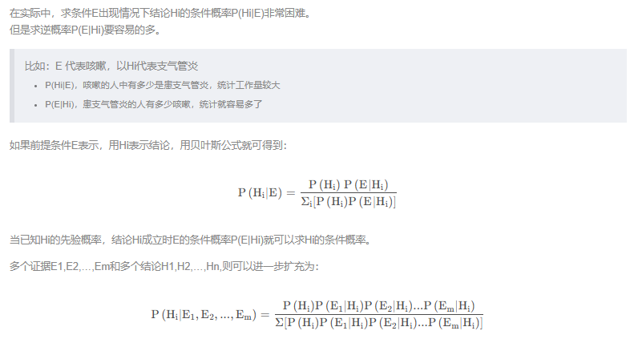

- 可信度方法

  - 可信度定义

    ```text
    可信度最初定义为信任与不信任的差。

    CF(H,E) = MB(H,E)-MD(H,E)

    CF(Certainty Factor，确定性因子)是由证据E得到假设H的可信度。

    MB(Measure Belief)称为信任增长度，表示E的出现使结论H为真的信任值增长程度。

    MD(Measure Disbelief)称为不信任增长度
    ```

  - 可信度 CF 的性质

    ```text
    （1）互斥性
    当MB(H,E)>0时， MD(H,E)=0
    当MD(H,E)>0时， MB(H,E)=0

    （2）值域
    0≤MB(H,E)≤1
    0≤MD(H,E)≤1
    -1≤CF(H,E)≤1

    （3）典型值
    CF(H,E)=1时，P(H|E)=1, MB(H,E)=1, MD(H,E)=0
    CF(H,E)=-1时，P(H|E)=0, MB(H,E)=0, MD(H,E)=1
    CF(H,E)=0时，P(H|E)=P(H)，MB(H,E)=0, MD(H,E)=0，表示E对H无影响

    （4）H的信任增长度等于非H的不信任增长度
    MB(H,E) = MD(¬H,E)
    MD(H,E) = MB(¬H,E)

    （5）H的可信度对非H的可信度之和等于0
    CF(H,E)+CF(¬H,E) = 0

    （6）可信度与概率的区别
    概率：P(H)+P(¬H)=1 且 0≤P(H),P(¬H)≤1
    可信度：-1≤CF(H,E)≤1

    （7）对于同一前提E，若支持多个不同的结论Hi，则ΣCF(Hi,E) ≤1

    （8）实际应用中，P(H)和 P(H|E)的值很难获得，因此CF(H,E)的值由领域专家给出。
    ```

  - 可信度模型

    - 简洁、直观、容易理解
    - 可能和条件概率得出的值相反、计算的累积可能导致一个规则和多个规则计算结果不同、组合规则顺序不同可能结果不同

- 因果关系网 p172

  - 贝叶斯网络是一个有向无环图，目前没有算法可以处理循环的因果关系

- D-分离（D-separated）
  - 小误差在多步计算后可能会趋近无穷大
  - 计算推理时，要考虑太多相关因素，复杂度太高，目的是降低算法复杂度，避免误差过大
  - 情况
    - 串行连接
    - 分叉连接
    - 汇集连接（重点关注p177 图5.10（b））
  - 会判断课本 p177 图 5.11 出现的阻塞情况和原因分析
  - 能写出条件独立、阻塞、D 分离的定义 课本 p178
- 主观贝叶斯
  - LS 和 LN 定义
  - 取值和证据的关系 课本 p184 表 5.1
  - 计算题不用看
- 不确定性的传播与更新
  - CF（A）：可信度，含义参考课本 p192 5.5.2
  - 基础公式
    - CF(A1 AND A2) = MIN{CF(A1),CF(A2)}
    - CF(A1 OR A2) = MAX{CF(A1),CF(A2)}
    - CF(NOT A) = -CF(A)
  - 合成公式
    - A1->B, CF1(B) = MAX(0,CF(A1)) \* CF(B,A1)
    - A2->B, CF2(B) = MAX(0,CF(A2)) \* CF(B,A2)
    - CF(B) = CF1(B) + CF2(B) - CF1(B)CF2(B)
  - 更新计算公式
    - 当 CF(A)=1
      - CF(B|A) = CF(B) + CF(B,A)(1-CF(B))
      - CF(B|A) = CF(B) + CF(B,A)(1+CF(B))
      - CF(B|A) = CF(B) + CF(B,A)
    - 当 0 < CF(A) <= 1
      - CF(B|A) = CF(B) + CF(A)CF(B,A)(1-CF(B))
      - CF(B|A) = CF(B) + CF(A)CF(B,A)(1+CF(B))
      - CF(B|A) = CF(B) + CF(A)CF(B,A)
    - 当 CF(A) < 0
      - 不需要使用本条规则了
    - 合成公式和更新公式是有计算顺序的考虑的，**不满足交换性的**
    - 推荐例题：课本 p194 5.4，p203 5.10
- 证据理论（D-S theory）
  - 举两个符合证据理论的完备元素集合 U 的实例
- 推荐习题  
  - 理论：课本p202 5.1 5.6 5.7 
  - 计算：课本p203 5.10 5.12 5.15

## 机器学习

- 传统机器学习
- 深度学习

## 高级搜索

- 模拟退火
- 遗传算法
